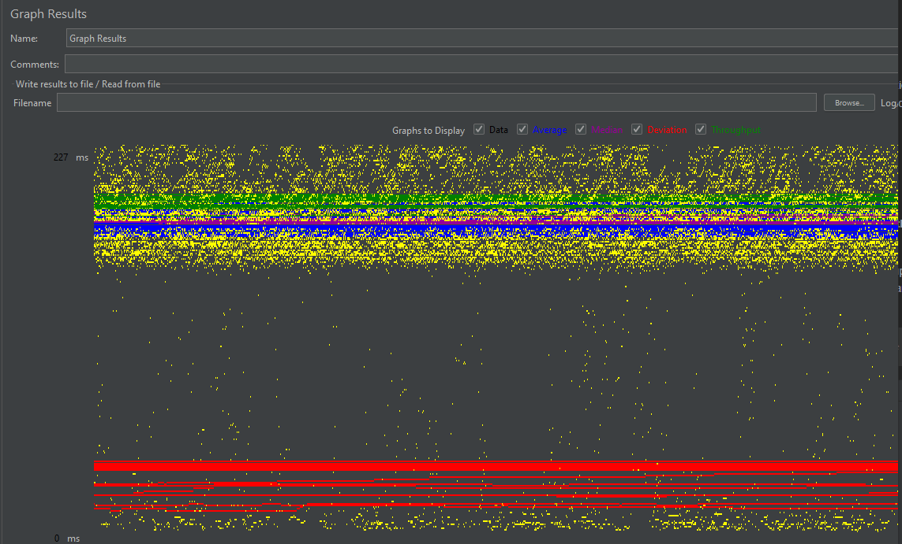
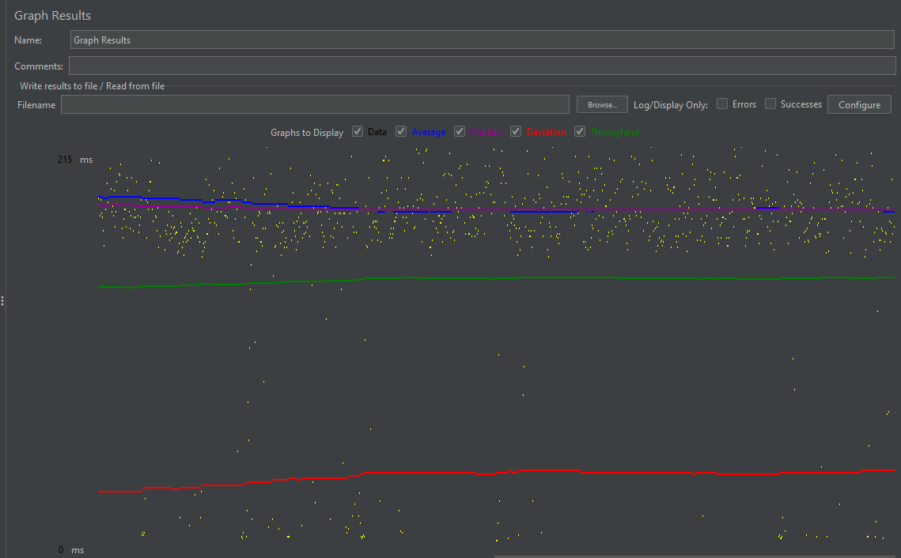
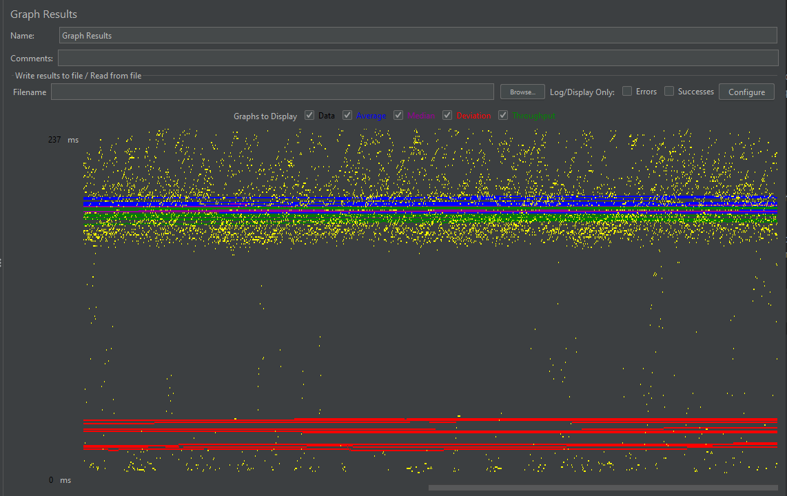

- # General
    - #### Team#: 37

    - #### Names:
      - Yaseen Khan(yaseenk@uci.edu)
      - Jadon Kwan(jadonk@uci.edu)

    - #### Project 5 Video Demo Link:

    - #### Instruction of deployment:
      - ##### Database Setup:
        - Download the latest version of MySQL if you don't have it 
        - Login to mysql as the root user: ```local> mysql -u root -p```
        - Create user CS122B and grant privileges
          ```
          mysql> CREATE USER 'CS122B'@'localhost' IDENTIFIED BY 'FabFlix';
          mysql> GRANT ALL PRIVILEGES ON * . * TO 'CS122B'@'localhost';
          mysql> quit;
          ```
        - Create the moviedb database
        ```
        local> mysql -u CS122B -p
        mysql> CREATE DATABASE IF NOT EXISTS moviedb;
        mysql> USE moviedb;
        mysql> quit;
        ```
        - Create the moviedb tables using the create_table.sql file: ```local> mysql -u CS122B -p < create_table.sql```
        - Populate the database data using the movie-data.sql file: ```local> mysql -u CS122B -p --database=moviedb < PATH/movie-data.sql```Populate the database data using the movie-data.sql file: ```local> mysql -u CS122B -p --database=moviedb < PATH/movie-data.sql```
      - ##### Option 1: Deploy from AWS
        - SSH into your AWS instance. EX: ```ssh -i My.pem ubuntu@ec2-myipaddress.us-west-2.compute.amazonaws.com```
        - Clone the github repo using ```git clone https://github.com/uci-jherold2-teaching/cs122b-fall-team-37.git```
        - If you don't have the moviedb database setup, follow the **Database Setup** instructions
        - If using a different database account, change the username and password in ```web/META_INF/context.xml```
        - Run ```mvn package``` to build the war file.
        - Copy the war file: ```sudo cp ./target/*.war /var/lib/tomcat9/webapps/```
        - Refresh your tomcat manager and deploy the app.
        - Head to the web page of your AWS instance.
      - ##### Option 2: Local(Intellij)
        - Clone the github repo using ```git clone https://github.com/uci-jherold2-teaching/cs122b-fall-team-37.git```
        - Open the Project in Intellij
        - If you don't have the moviedb database setup, follow the **Database Setup** instructions
        - If using a different database account, change the username and password in ```web/META_INF/context.xml```
        - Build project using maven.
        - Set up tomcat to use your war file (IntelliJ has configuration with Tomcat).
        - Open your localhost to the correct port.

    - #### Collaborations and Work Distribution:
      - ##### Yaseen Khan
      - Set up Connection Pooling
      - Performed Single-Instance JMeter tests
      - Wrote log_processing.py script
      - ##### Jadon Kwan
      - Set Up Master/Slave instances
      - Set Up Load Balancer
      - Performed Scaled JMeter tests


- # Connection Pooling
    - #### Include the filename/path of all code/configuration files in GitHub of using JDBC Connection Pooling.
      - src/main/java/FullTextSearchServlet.java
      - src/main/java/SearchMovieServlet.java
      - src/main/java/AutocompleteSearchServlet.java
      - WebContent/META-INF/context.xml

    - #### Explain how Connection Pooling is utilized in the Fabflix code.
    - Connection Pooling is utilized in the Search servlets for the JMeter tests. The connection pool configurations are in the context.xml file. The max number of pool connections is 100. The max number of idle connections is 30. The maximum timeout period for a connection is 10000 ms. Additionally, the Prepared Statements for each servlet is cached so more than one JDBC connection can utilize these statements. Caching the Prepared Statements is needed since Prepared Statements are usually associated with one Connection. Once all the Prepared Statements are executed, the database connection closes.

    - #### Explain how Connection Pooling works with two backend SQL.


- # Master/Slave
    - #### Include the filename/path of all code/configuration files in GitHub of routing queries to Master/Slave SQL.
    WebContent/META-INF/context.xml

    - #### How read/write requests were routed to Master/Slave SQL?
    For the Slave Instance, if it is given a write request, it uses a different connection and connects to the Master database rather than the localhost (its own). So even if it still receives write requests which is intended, it will write to the other database using the different connection.

- # JMeter TS/TJ Time Logs
    - #### Instructions of how to use the `log_processing.*` script to process the JMeter logs.
    - The log processing script is written using Python3
    - The JMeter logs are stored as text files. The log processing script only supports text files
    - To run log_processing.py, you need 2 parameters: directory/filename.txt and a positive integer representing the test case
     ```
        python3 log_processing.py <directory_name>/logfile.txt <integer case number>
     ```
    - If the log files are in the same directory as log_processing.py script, then the directory name does not need to be specified
    ```
        python3 log_processing.py logfile.txt <integer case number>
    ```


- # JMeter TS/TJ Time Measurement Report

| **Single-instance Version Test Plan**          | **Graph Results Screenshot**                                   | **Average Query Time(ms)** | **Average Search Servlet Time(ms)** | **Average JDBC Time(ms)** | **Analysis** |
|------------------------------------------------|----------------------------------------------------------------|----------------------------|-------------------------------------|---------------------------|--------------|
| Case 1: HTTP/1 thread                          | [Case 1](JMeter/graph_results/Single-Instance-Test-Case-1.png) | 45                         | ??                                  | ??                        | ??           |
| Case 2: HTTP/10 threads                        | [Case 2](JMeter/graph_results/Single-Instance-Test-Case-2.png) | 288                        | ??                                  | ??                        | ??           |
| Case 3: HTTPS/10 threads                       | [Case 3](JMeter/graph_results/Single-Instance-Test-Case-3.png) | 323                        | ??                                  | ??                        | ??           |
| Case 4: HTTP/10 threads/No connection pooling  | [Case 4](JMeter/graph_results/Single-Instance-Test-Case-4.png) | 239                        | ??                                  | ??                        | ??           |

| **Scaled Version Test Plan**                   | **Graph Results Screenshot**                                    | **Average Query Time(ms)** | **Average Search Servlet Time(ms)** | **Average JDBC Time(ms)** | **Analysis**                                                                                                                                                                                           |
|------------------------------------------------|-----------------------------------------------------------------|----------------------------|-------------------------------------|---------------------------|--------------------------------------------------------------------------------------------------------------------------------------------------------------------------------------------------------|
| Case 1: HTTP/1 thread                          |  | 181                        | ??                                  | ??                        | With only 1 thread, the timing was the same as 10 threads with no pooling. This is likely because connection pooling only helps when there's a lot of traffic.                                         |
| Case 2: HTTP/10 threads                        |  | 178                        | ??                                  | ??                        | With pooling it was slightly faster and despite there being 10 threads.                                                                                                                                |
| Case 3: HTTP/10 threads/No connection pooling  |  | 181                        | ??                                  | ??                        | With 10 threads, it was not that much slower than 1 thread, but it was still not as fast as with the connection pooling. So the connection pooling appears to help only when there's a lot of traffic. |

